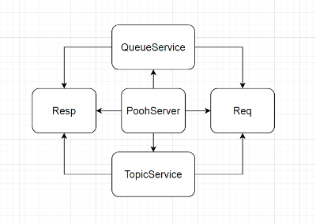

# job4j_pooh

## Проект "Pooh JMS"

Учебный проект. Создается аналог асинхронной очереди.

Приложение запускает Socket и ждет клиентов.

Клиенты могут быть двух типов: отправители (publisher), получатели (subscriber).

В качестве протокола используется HTTP. 

Архитектура проекта:

- Req - класс, служит для парсинга входящего запроса.
- Resp - ответ от сервиса.

В курсе производилась работа с ветками git.